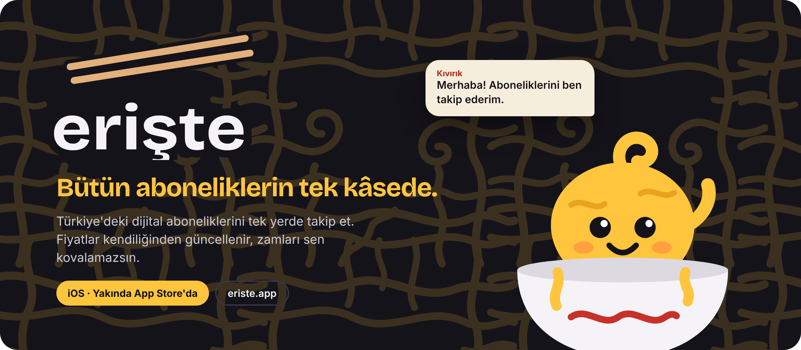
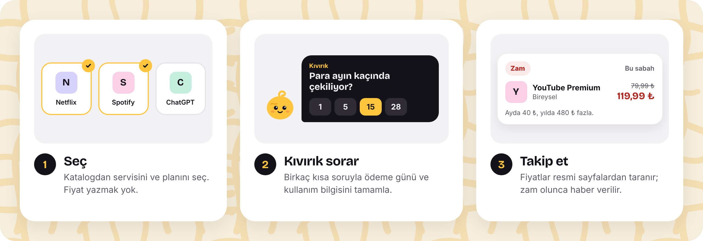
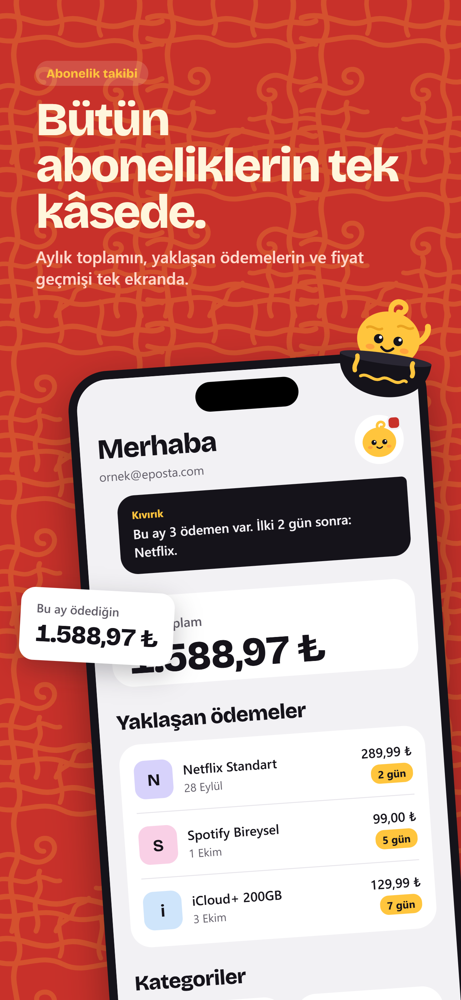
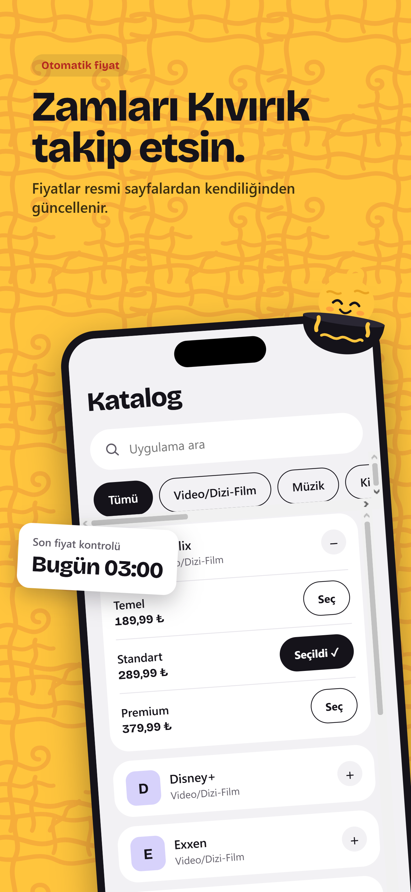
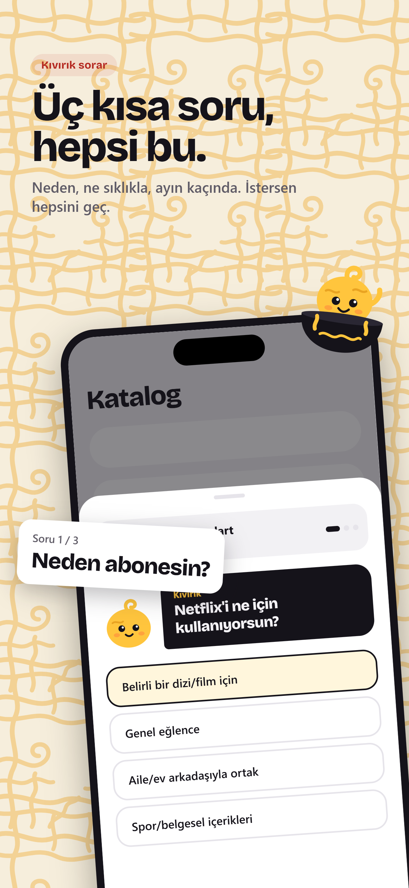
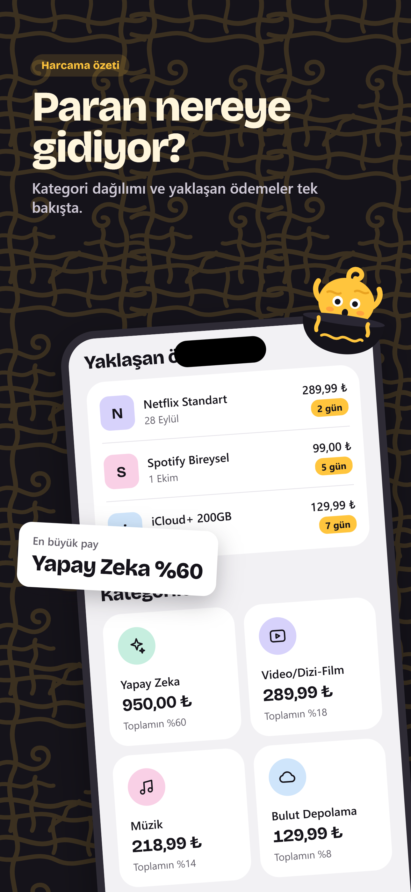
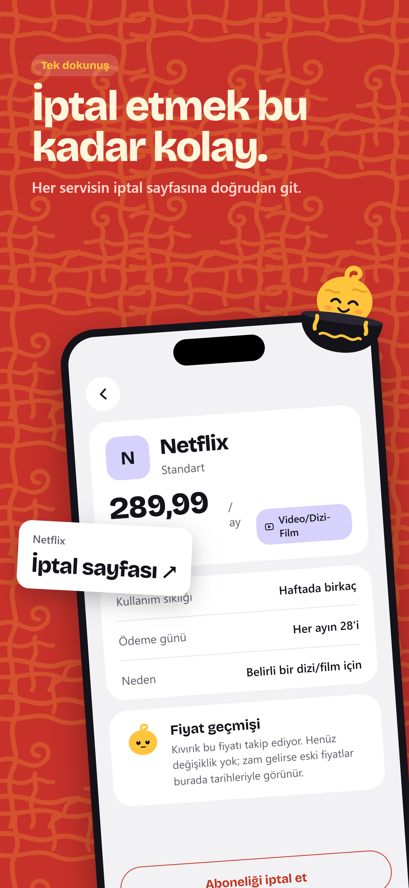
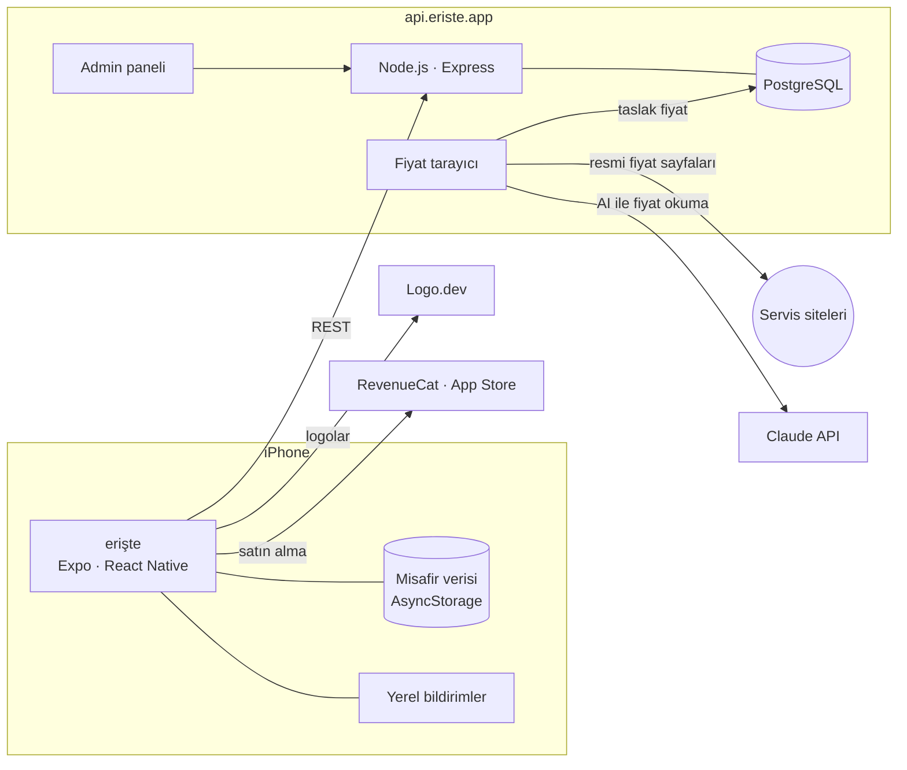
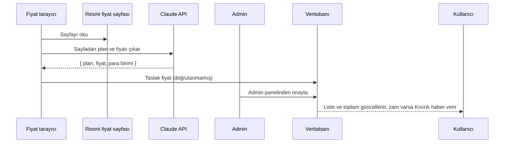
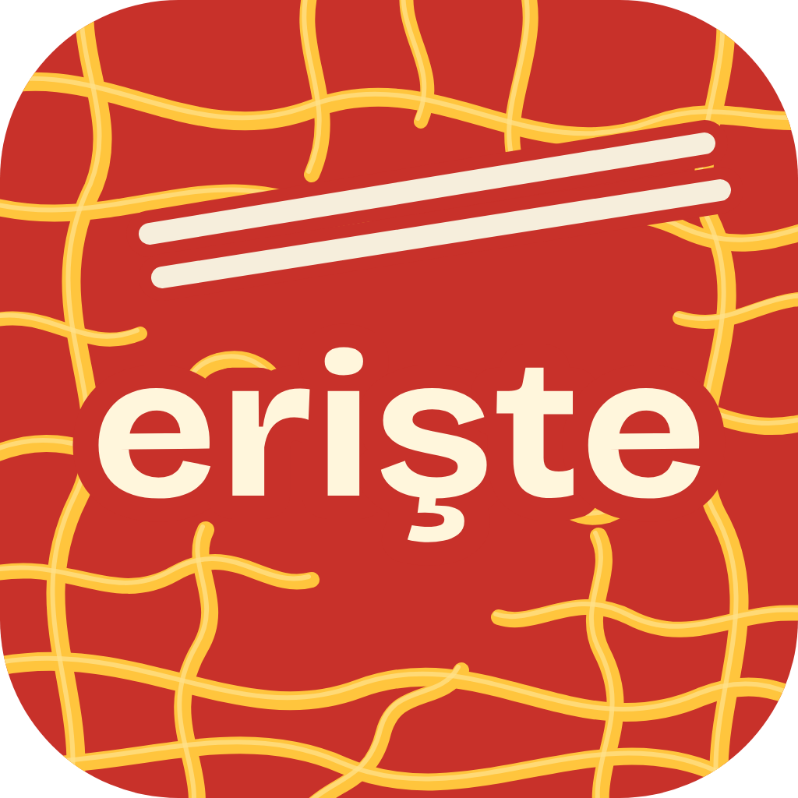

<p align="center">
  
</p>

<p align="center">
  
  
  
  
  
</p>

<p align="center">
  <b>erişte</b>, Türkiye'deki dijital aboneliklerini tek yerde toplayan bir iOS uygulaması.<br>
  Fiyatı sen yazmazsın: katalogdan seçersin, fiyatlar resmi sayfalardan taranır, zam olunca haber verilir.
</p>

<p align="center">
  <a href="https://eriste.app"><b>eriste.app</b></a> ·
  <a href="#özellikler">Özellikler</a> ·
  <a href="#nasıl-çalışır">Nasıl çalışır</a> ·
  <a href="#mimari">Mimari</a> ·
  <a href="#kurulum">Kurulum</a> ·
  <a href="#yol-haritası">Yol haritası</a>
</p>

---

## Neden erişte?

Netflix, Spotify, YouTube Premium, ChatGPT, iCloud… Abonelikler küçük küçük birikir, zamlar sessizce gelir, deneme süreleri unutulur. Mevcut çözümler ya banka hesabını bağlamanı ister ya da her fiyatı elle girmeni.

erişte ikisini de istemez:

- **Banka bağlamak yok.** Hiçbir hesap ya da kart bilgisi istenmez.
- **Fiyat yazmak yok.** Servisi ve planı katalogdan seçersin; güncel Türkiye fiyatı hazır gelir.
- **Zamları sen kovalamazsın.** Fiyatlar resmi sayfalardan düzenli olarak taranır, değişince listene yansır.
- **Reklam yok, izleme yok.**

## Nasıl çalışır

<p align="center">
  
</p>

## Özellikler

<table>
<tr>
<td width="50%" valign="top">

### Katalogdan seç
Video, müzik, yapay zekâ, bulut, oyun, üretkenlik… Türkiye'de yaygın servisler, planları ve gerçek logolarıyla hazır.

### Otomatik fiyat takibi
Katalog fiyatları resmi fiyat sayfalarından yapay zekâ ile okunur. Admin onayından geçen fiyatlar herkesin listesinde güncellenir.

### Ödeme hatırlatmaları
Ödeme gününden önce cihazda planlanan bildirimler: *"Yarın Netflix ödemen var: 289,99 ₺"*

### Dolar fiyatlı abonelikler
ChatGPT, Claude gibi dolar bazlı planlar güncel kurla TL'ye çevrilir.

</td>
<td width="50%" valign="top">

### Kıvırık sorar
Maskotumuz Kıvırık, eksik bilgileri tek dokunuşluk kısa sorularla tamamlar: ödeme günü, kullanım sıklığı, ödeme kanalı. Bir seferde en fazla 3 soru.

### Kullanmadığını yakalar
*"Neredeyse hiç"* dediğin bir abonelik için yıllık maliyeti gösterir ve iptal adımlarına götürür.

### Toplam, kategori, yaklaşan ödemeler
Aylık toplam, kategori dağılımı ve sıradaki ödemeler tek ekranda. Açık ve koyu tema.

### Misafir modu
Hesap açmadan 5 aboneliğe kadar dene; sonra tek dokunuşla hesabına aktar.

</td>
</tr>
</table>

## Ekranlar

<p align="center">
  
  
  
  
  
</p>

## Kıvırık ile tanış

<table>
<tr>
<td width="200" align="center"></td>
<td>

**Kıvırık**, kâsenin içinden çıkan kıvırcık bir erişte teli. Uygulamada logonun yerinde, sağ üstte durur. Abonelik eklerken soruları o sorar, sorusu olduğunda rozetle haber verir, zam geldiğinde ilk o fark eder.

> *"Dur, sana soracaklarım var! 3 kısa soru, tek dokunuşla."*

</td>
</tr>
</table>

## Mimari



### Fiyat nasıl güncellenir?



## Teknolojiler

| Katman | Kullanılanlar |
| --- | --- |
| Mobil | Expo SDK 57, React Native, react-native-svg, expo-image, expo-notifications, AsyncStorage |
| Ödeme | App Store abonelikleri, RevenueCat (`premium` entitlement, aylık ve yıllık plan) |
| Backend | Node.js 24, Express, PM2, Nginx |
| Veritabanı | PostgreSQL (RLS politikalarıyla) |
| Fiyat tarama | Claude API (Batch), admin onaylı taslak akışı |
| Logolar | Logo.dev, admin panelinden düzenlenebilir |
| Altyapı | Hetzner, Cloudflare (DNS, Pages, R2 yedekleri) |
| Tasarım | Bricolage Grotesque, kendi marka sistemi ve maskot |

## Proje yapısı

```
.
├── mobile/                 # Expo uygulaması
│   ├── src/
│   │   ├── components/     # ortak bileşenler, brand/ (logo, Kıvırık, erişte deseni)
│   │   ├── screens/        # onboarding, ana sayfa, katalog, detay, paywall, profil
│   │   ├── theme/          # renkler, tipografi, açık/koyu tema
│   │   ├── api/            # backend istemcisi
│   │   └── utils/          # ödeme günü, bildirim planlama, para birimi
│   └── scripts/            # marka görsellerini (ikon, splash) üreten script
├── backend/
│   ├── src/                # Express API, admin paneli, fiyat tarayıcı
│   ├── db/migrations/      # SQL migration dosyaları
│   └── scripts/            # katalog seed ve bakım scriptleri
└── docs/                   # tasarım ve geliştirme notları
```

## Kurulum

> Geliştirme için Node.js 24, bir PostgreSQL veritabanı, Expo hesabı ve fiziksel bir iPhone gerekir. Gizli anahtarlar repoda tutulmaz; `.env.example` dosyalarını kopyalayıp doldur.

### 1. Backend

```bash
cd backend
npm install
cp .env.example .env     # veritabanı bağlantısı, admin anahtarı, API anahtarları
npm run dev              # http://0.0.0.0:3000
```

Migration'ları `backend/db/migrations/` altındaki sırayla veritabanında çalıştır.

### 2. Mobil

```bash
cd mobile
npm install
cp .env.example .env     # EXPO_PUBLIC_API_URL=http://<bilgisayarın-yerel-ip>:3000 ve diğer anahtarlar
```

Uygulama native modüller kullandığı için Expo Go yerine **development build** gerekir:

```bash
eas build --profile development --platform ios   # bir kez, ya da native paket eklenince
npx expo start --dev-client --clear
```

Telefon ve bilgisayar aynı Wi-Fi ağında olmalı. Uygulama içi satın almaları denemek için App Store Connect'te bir sandbox test hesabı kullan.

## Yol haritası

- [x] Katalog, logolar ve admin paneli
- [x] Misafir modu ve hesaba aktarım
- [x] Duolingo tarzı açılış akışı
- [x] Ödeme günü ve yerel ödeme hatırlatmaları
- [x] Premium (aylık / yıllık) ve erişte'nin kendi aboneliğinin listede görünmesi
- [ ] Kıvırık soruları ve "İptal ettim" akışı
- [ ] Kendi sunucumuza geçiş ve 1.0 yayını
- [ ] Zam ve deneme bitişi kartları, aylık kullanım kontrolü
- [ ] Ana ekran widget'ı
- [ ] Aile / paylaşılan abonelikler ve masraf bölme
- [ ] Android

## Gizlilik ilkeleri

- Banka hesabı, kart bilgisi, konum ya da rehber istenmez.
- Reklam ve üçüncü taraf izleme SDK'sı yoktur.
- Misafir modundaki veriler yalnızca cihazda durur.
- Fiyat taramasında yapay zekâya yalnızca herkese açık fiyat sayfaları gönderilir; kullanıcı verisi gönderilmez.
- Hesap uygulama içinden silinebilir.

Ayrıntılar: [eriste.app/gizlilik](https://eriste.app/gizlilik)

## İletişim

**Muhammed Koçhan** · [muhammedkochandev@gmail.com](mailto:muhammedkochandev@gmail.com)

---

<p align="center">
  <br>
  <sub>© 2026 erişte. Tüm hakları saklıdır.</sub>
</p>
